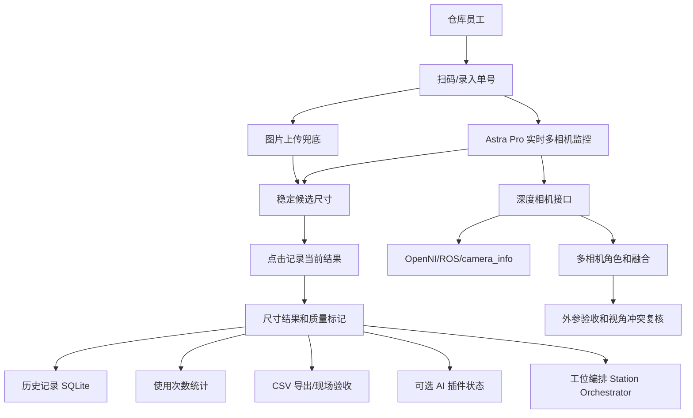

# PackVision Local 项目报告

> 当前分支：`codex/astra-pro-depth-camera`  
> 项目目录：`D:\Documents\包装尺寸检测`  
> 当前定位：面向汽车备件仓库的本地包装尺寸检测工作台，主流程是 Astra Pro 深度相机实时监控、稳定后记录，图片上传只作为无硬件/离线兜底；支持单号追溯、海外仓交付包和后续多相机/AI 插件扩展。

## 1. 项目一句话

PackVision 不是单纯的“拍照量尺寸 Demo”，而是给海外汽车备件仓库使用的本地 DWS 测量系统：仓库员工扫码或录入单号后放件，系统在多相机监控画面中持续测量，画面稳定后点击记录，自动完成尺寸、体积重、异常提示、历史保存、使用次数统计和 CSV 导出。

## 2. 背景和目标

仓库现场的真实约束是：

- 员工不适合手动输入焦距、光圈、相机内参等工程参数。
- 手机照片可以作为无硬件阶段的兜底，但单目照片不能稳定恢复真实三维尺寸。
- 深度相机到货后，测量主线应切到 Astra Pro 深度帧、厂商/ROS/OpenNI 内参和质量门控。
- 海外仓电脑多为普通 Windows 办公电脑，不能默认有强显卡。
- 交付包要轻量、可复制、可诊断，压缩包目标不超过 `100 MB`。
- 后续可能从 1 台 Astra Pro 扩展到 2 台、3 台，甚至替换更高端深度相机。

项目目标分三层：

| 层级 | 目标 |
| --- | --- |
| 图片版 | 没有相机时也能上传图片、扫码、保存历史、导出结果。 |
| Astra Pro 版 | 接入深度相机，做真实三维测量和现场精度验证。 |
| 多相机/AI 版 | 后续支持三视图、多相机融合、YOLO/分割/单目深度插件。 |

## 3. 当前完成状态

| 模块 | 状态 | 说明 |
| --- | --- | --- |
| 本地 Web UI | 已完成基础版 | 支持中文、English、Українська，支持明亮/深色/石墨主题。 |
| 图片上传测量 | 已完成 | 顶部图、侧面图、ArUco、相机距离/焦距估算、手动框选。 |
| 单号和条码 | 已完成 | 支持手动单号、扫码枪文本、上传条码/二维码图片识别。 |
| 历史追溯 | 已完成 | SQLite 保存时间戳、单号、尺寸、置信度、上传图、标注图。 |
| 使用次数统计 | 已完成 | 后台记录接口调用次数、测量次数、成功/失败次数，可导出 CSV。 |
| WMS/TMS 本地集成队列 | 已完成底座 | 每次保存测量记录时同步写入本地 outbox，WMS/TMS 不在线也不影响现场继续测量；数据中心可查看和导出 CSV。 |
| 实时采集监控 | 已完成并升级 | Astra Pro 实时流持续测量，按钮只负责记录稳定结果；UI 显示顶部/正面/侧面多相机监控矩阵、FPS、运行时长、测量次数和采集后端。 |
| 体积重/计费重 | 已完成 | 支持手动输入实重，按体积重规则表计算体积重和计费重，并保存计费来源。 |
| 电子秤适配接口 | 已完成轻量底座 | 基础包保留手动实重兜底，预留 mock、USB HID、RS232 adapter。 |
| DWS 工位 UI | 持续强化 | 首屏常驻工位状态、当前单号、计费重、质检结论、工位编排成熟度、到货验收状态和深度证据面板。 |
| 现场支持包 | 已完成 | 一键导出环境体检、日志、历史、用量、复核样本和真值模板，默认不包含现场图片。 |
| 异形件/长条件 | 已有深度算法基础 | 支持深度 ROI、object mask、长条件主轴测量。 |
| Astra Pro 适配 | 已完成无硬件开发底座 | 驱动/上位机/OpenNI 状态检查、内参归一化、采集探测、模拟干跑。 |
| 设备守护和恢复 | 已完成轻量底座 | 汇总 OpenNI 运行库、相机枚举、实时流卡顿、模拟兜底和恢复动作，供 UI 和现场支持包排错。 |
| 多相机冗余 | 已有架构 | 相机角色、序列号、三视图缺口、保守融合接口已预留。 |
| 海外仓交付包 | 已完成第一版 | 可生成小于 `100 MB` 的现场交付压缩包。 |
| 自动化开发流程 | 已配置 | `packvision` 自动化已按分阶段落地模式启用。 |

当前验证结果：

```text
115 passed in 7.92s
```

最新已验证交付包：

```text
D:\Documents\包装尺寸检测\release\PackVision_Field_Kit_*.zip
```

大小约：

```text
73.55 MB
```

## 4. 运行方式

开发环境运行：

```powershell
py -3.11 -m venv .venv
.\.venv\Scripts\python.exe -m pip install -r requirements.txt
.\.venv\Scripts\python.exe -m packvision.main
```

打开：

```text
http://127.0.0.1:8765
```

如果端口被占用，PackVision 会自动尝试后续端口，例如 `8766`。

## 5. 打包和交付

打包 EXE：

```powershell
PowerShell -ExecutionPolicy Bypass -File .\scripts\build_exe.ps1
```

输出：

```text
D:\Documents\包装尺寸检测\dist\PackVision.exe
```

生成海外仓现场交付包：

```powershell
PowerShell -ExecutionPolicy Bypass -File .\scripts\build_handoff_package.ps1
```

输出目录：

```text
D:\Documents\包装尺寸检测\release
```

交付包会包含：

- `PackVision.exe`
- `START_HERE.txt`
- `check_astra_depth_status.ps1`
- `docs_cn`
- `docs_obsidian\PackVision`

默认限制：

```text
100 MB
```

超过限制时脚本会失败，避免后续传输困难。

## 6. 开箱即用边界

PackVision 软件包可以复制即用，但 Astra Pro 深度相机不能完全免驱动。

| 场景 | 是否只靠 EXE | 说明 |
| --- | --- | --- |
| 手机照片/上传图片测量 | 可以 | 不需要相机驱动。 |
| 单号、扫码、历史、CSV | 可以 | 数据保存在本机用户目录。 |
| Astra Pro 实时采集 | 不可以 | 目标电脑必须先安装 Astra Pro Windows 驱动，并用 OrbbecViewer 验证画面。 |
| 两台/三台相机 | 需要现场调试 | 需要供电、USB 稳定性、支架、序列号绑定和视角验证。 |

目标海外仓提前准备：

- Astra Pro 相机。
- Windows 10/11 64 位电脑。
- Astra Pro Windows 驱动。
- OrbbecViewer。
- 原装 USB 数据线；如需延长，优先主动 USB-A 公对母延长线。
- 厂商棋盘格标定板，优先从 `GET /api/depth/vendor-calibration-board.pdf` 打印；A4 ArUco 只作为手机照片兜底比例尺。
- 稳定支架、哑光工作台、稳定光照。
- 卷尺/卡尺、标准纸箱、长条件、异形件、黑色/反光/透明样品。

## 7. 体检接口和现场脚本

开箱即用体检接口：

```text
GET /api/deployment/readiness
GET /api/deployment/support-bundle.zip
```

它会检查：

- 图片版是否可运行。
- 本地历史和结果目录是否可写。
- EXE 是否存在、大小是否符合传输限制。
- Astra Pro 厂商资料、驱动、OrbbecViewer、OpenNI runtime 是否存在。
- 当前是否检测到深度相机。
- 海外仓到货前需要准备哪些物理物品。
- 到现场后的操作顺序。

现场支持包会生成一个 zip，包含体检结果、深度相机状态、采集后端状态、AI 插件状态、历史 CSV、使用日志 CSV、复核样本、真值模板和 `PackVision.log`。默认不包含上传照片和标注图片，便于控制文件大小和现场隐私。

现场脚本：

```powershell
PowerShell -ExecutionPolicy Bypass -File .\scripts\check_astra_depth_status.ps1
```

在源码目录中，它会直接调用 Python 服务输出完整 readiness 结果。  
在现场交付包目录中，它会提示或访问本地 EXE API，帮助判断环境是否可用。

## 8. 核心 API

### 基础

| 接口 | 用途 |
| --- | --- |
| `GET /api/health` | 运行状态。 |
| `GET /api/demo-image.jpg` | 演示图片。 |
| `GET /api/depth/vendor-calibration-board.pdf` | Astra Pro 厂商棋盘格标定板，工程复核/重标定使用。 |
| `GET /api/calibration-card.svg` | A4 ArUco 照片兜底标定卡，不作为 Astra Pro 主标定入口。 |
| `GET /api/deployment/readiness` | 海外仓交付和环境体检。 |
| `GET /api/deployment/support-bundle.zip` | 现场远程排错支持包。 |
| `GET /api/station/snapshot` | DWS 工位编排快照，汇总尺寸、称重、扫码、证据、接口状态和工业级缺口。 |
| `GET /api/device/watchdog` | 设备守护状态，汇总相机枚举、实时流是否卡住、模拟兜底和现场恢复步骤。 |

### 图片测量

| 接口 | 用途 |
| --- | --- |
| `POST /api/measure` | 上传顶部/侧面图片测量。 |
| `POST /api/capture/quality` | 检查照片过曝、欠曝、反光等风险。 |

### 单号和历史

| 接口 | 用途 |
| --- | --- |
| `POST /api/orders/scan` | 扫码枪/手工单号标准化。 |
| `POST /api/orders/decode-image` | 上传条码/二维码图片识别单号。 |
| `GET /api/history` | 历史记录列表。 |
| `GET /api/history/export.csv` | 导出历史 CSV。 |
| `GET /api/history/{measurement_id}` | 单条记录详情。 |

### 使用统计

| 接口 | 用途 |
| --- | --- |
| `GET /api/usage/summary` | 使用次数和测量次数汇总。 |
| `GET /api/usage/events` | 接口调用日志。 |
| `GET /api/usage/export.csv` | 导出使用日志 CSV。 |

### WMS/TMS 本地集成队列

| 接口 | 用途 |
| --- | --- |
| `GET /api/integrations/outbox` | 查看待推送、失败、已推送的本地集成事件。 |
| `GET /api/integrations/outbox/summary` | 查看本地 outbox 汇总、最新事件和重试状态。 |
| `GET /api/integrations/outbox/export.csv` | 导出本地集成队列 CSV，方便先交给 WMS/TMS 或 Excel 对账。 |
| `POST /api/integrations/outbox/{event_id}` | 更新事件状态，为后续真实连接器和重试 worker 预留。 |

### Astra Pro 深度相机

| 接口 | 用途 |
| --- | --- |
| `GET /api/depth/status` | 驱动、OpenNI、厂商资料状态。 |
| `GET /api/depth/vendor-profile` | Astra Pro 厂商参数和标定策略。 |
| `GET /api/depth/astra/tutorial-playbook` | 厂商教程二次审计后的控制、标定、多相机说明。 |
| `GET /api/depth/cameras` | 相机配置、角色、三视图缺口。 |
| `GET /api/depth/capture/capabilities` | 可用采集后端。 |
| `POST /api/depth/capture/probe` | 探测当前相机是否可采集。 |
| `POST /api/depth/capture/frame` | 采集一帧深度数据。 |
| `POST /api/depth/measure-capture` | 默认工作台主流程：采集 Astra Pro 深度帧并直接测量；未传 ROI 时自动使用中心作业区。 |
| `POST /api/depth/live/start` | 启动实时深度采集流。 |
| `GET /api/depth/live/state` | 获取实时状态、FPS、运行时长、稳定帧和当前尺寸候选。 |
| `POST /api/depth/live/confirm` | 保存当前稳定测量结果。 |
| `POST /api/depth/live/stop` | 暂停实时采集流。 |
| `POST /api/depth/camera-info/normalize` | 把 ROS/OpenNI/camera_info 转成测量内参。 |
| `POST /api/depth/measure-roi` | 用深度 ROI 测规则物体。 |
| `POST /api/depth/measure-object` | 用 object mask 测异形件。 |
| `POST /api/depth/quality` | 深度质量门控。 |
| `POST /api/depth/fuse-measurements` | 多视角结果保守融合。 |
| `POST /api/depth/extrinsics/validate` | 两台/三台相机外参、角色、序列号和视角冲突验收。 |

### 重量和计费

| 接口 | 用途 |
| --- | --- |
| `GET /api/weight/volumetric-rules` | 返回体积重规则表，例如 5000、6000、8000。 |
| `GET /api/scale/status` | 电子秤 adapter 状态；基础包默认手动实重兜底。 |
| `POST /api/scale/read` | 读取电子秤重量；未配置硬件时返回手动兜底。 |
| `POST /api/industry/profile` | 根据尺寸、包装、材质、实重和体积重规则计算行业摘要、体积重和计费重。 |

### 现场验证

| 接口 | 用途 |
| --- | --- |
| `GET /api/validation/trial-plan` | 到货验收抽检计划。 |
| `GET /api/validation/trial-template.csv` | WPS/Excel 可填写真值模板。 |
| `POST /api/validation/evaluate` | 评估人工真值和系统测量误差。 |
| `POST /api/validation/evaluate-csv` | 批量评估试运行 CSV。 |
| `GET /api/review/truth-template.csv` | 从复核样本池导出 WPS/Excel 真值填写模板。 |
| `GET /api/ai/plugins` | 可选 AI 模型插件清单、依赖和模型文件体检；基础包不内置重模型。 |

## 9. 技术架构



主要技术：

- FastAPI 本地 API。
- OpenCV ArUco、轮廓、条码/二维码。
- SQLite 本地历史和统计。
- 电子秤 adapter 接口，默认手动兜底，后续可扩展 USB HID/RS232。
- OpenNI/PrimeSense Astra Pro 采集后端。
- 多相机外参验收、角色绑定和保守融合冲突检查。
- 可选 AI 插件协议，默认不携带 YOLO/SAM/Depth 模型权重。
- PyInstaller Windows EXE。
- PowerShell 交付和体检脚本。

## 10. 对标和取舍

PackVision 借鉴但不直接复制这些方向：

| 对标方向 | 学习点 | 当前取舍 |
| --- | --- | --- |
| OpenCV | 标定、轮廓、二维码、ArUco | 已作为基础能力使用。 |
| Ultralytics YOLO | 检测、分割、OBB、模型导出 | 后续做插件，不进入基础包。 |
| Segment Anything | 人工复核快速贴边 | 作为复核增强候选，不默认集成。 |
| Depth Anything V2 | 手机照片相对深度辅助 | 只能做辅助，不能承诺毫米级真实尺寸。 |
| Open3D | 点云和多视图配准 | 后续多相机阶段参考。 |
| CVAT/Label Studio | 标注和复核闭环 | 后续做失败样本池和训练数据导出。 |

核心取舍：

- 基础包保持轻量。
- 重模型插件化。
- 仓库员工不接触工程参数。
- 模拟结果、单目估算、未硬件验证都必须明确标注。

## 11. 当前风险

| 风险 | 当前状态 | 应对 |
| --- | --- | --- |
| Astra Pro 真实硬件未连接验证 | 待相机到货 | 到货后先跑 OrbbecViewer，再跑 readiness 和 capture probe。 |
| 单目照片精度有限 | 已在文档和置信度中说明 | 图片版作为兜底，真实尺寸主线切深度相机。 |
| 异形件/异常材质样本不足 | 待现场采集 | 建立复核样本池和真值模板。 |
| 多相机外参未真实验证 | 已有外参验收接口 | 相机到货和支架固定后，用已知纸箱跑 `/api/depth/extrinsics/validate`。 |
| AI 模型可能导致包变重 | 已做轻量插件协议 | 基础包不带权重；`models/` 只维护插件清单和可选模型入口。 |

## 12. 开发自动化和分支策略

本地开发循环：

```powershell
PowerShell -ExecutionPolicy Bypass -File .\scripts\dev_cycle.ps1
```

带打包验证：

```powershell
PowerShell -ExecutionPolicy Bypass -File .\scripts\dev_cycle.ps1 -BuildPackage
```

当前自动化任务：

```text
packvision
```

状态：

```text
ACTIVE
```

主开发分支：

```text
codex/astra-pro-depth-camera
```

分歧探索分支规则：

| 分支 | 用途 |
| --- | --- |
| `codex/packvision-ui-auto-workstation` | 工业现场 UI 自动化。 |
| `codex/packvision-review-sample-pool` | 真值模板和复核样本池。 |
| `codex/packvision-ai-plugin-spike` | AI 模型插件探索。 |
| `codex/packvision-multiview-extrinsics` | 多相机外参和融合探索。 |

## 13. 后续开发计划

优先级：

1. 工业现场 UI 自动化：默认扫码、放件、自动测量、结果、复核。
2. 真值模板和复核样本池：让失败/低置信/人工改框样本可追溯、可导出。
3. Astra Pro 到货真实验证：标准纸箱、长条件、异形件、异常材质全流程测试。
4. AI 插件接口：定义模型插件目录和 ONNX Runtime CPU 优先策略。
5. 多相机三视图：top/front/side，序列号绑定，视角冲突复核，保守融合。

## 14. 文档入口

中文文档：

```text
D:\Documents\包装尺寸检测\docs_cn
```

Obsidian 笔记：

```text
D:\Documents\包装尺寸检测\docs_obsidian\PackVision
```

重点文档：

- `docs_cn\20_PackVision_对标差距与开发计划.md`
- `docs_cn\21_海外仓开箱即用交付方案.md`
- `docs_cn\22_PackVision_分阶段开发执行与自动化.md`
- `docs_cn\23_PackVision_完整项目报告.md`
- `docs_cn\24_厂商资料包Git维护策略.md`
- `docs_cn\25_复核样本池与真值闭环.md`
- `docs_cn\26_AI插件接口与轻量部署策略.md`
- `docs_cn\27_多相机外参与三视图验收方案.md`
- `docs_cn\28_开发方向二次审计与高星项目差距.md`
- `docs_obsidian\PackVision\14 PackVision 完整项目报告.md`
- `docs_obsidian\PackVision\15 厂商资料包 Git 维护策略.md`
- `docs_obsidian\PackVision\16 复核样本池与真值闭环.md`
- `docs_obsidian\PackVision\17 AI 插件接口与轻量部署策略.md`
- `docs_obsidian\PackVision\18 多相机外参与三视图验收方案.md`
- `docs_obsidian\PackVision\19 开发方向二次审计与高星项目差距.md`

## 15. 厂商资料包维护策略

当前 Astra Pro 厂商资料包位于：

```text
D:\Documents\包装尺寸检测\奥比中光Astra Pro
```

统计结果：

- 文件数：`158`
- 总大小：`367.44 MB`
- 最大单文件：`82.61 MB`
- 超过 GitHub 普通 `100 MB` 单文件限制：`0`

技术上可以提交，但不建议直接把完整原始包塞进普通 Git 历史。PackVision 现在采用：

- 普通 Git 追踪 `vendor_assets` 下的 README、manifest、SHA-256 校验和维护说明。
- 原始驱动、SDK、DLL、PDF、示例包继续保留本地或迁入 Git LFS/私有 Release 资产。
- 后续新增厂商相机时，每个相机单独建立 `vendor_assets/<camera-id>/`。

当前清单：

```text
D:\Documents\包装尺寸检测\vendor_assets\orbbec-astra-pro\manifest.json
```

生成命令：

```powershell
PowerShell -ExecutionPolicy Bypass -File .\scripts\inventory_vendor_package.ps1
```

## 16. 当前结论

PackVision 已经从“图片测量 Demo”推进为可交付的本地仓库测量工作台雏形：

- 图片版可以开箱即用。
- 深度相机版已经具备接入和验收底座。
- 海外仓交付包可以生成，并保持在 100 MB 内。
- 历史、统计、单号、CSV、文档和自动化已经形成闭环。
- 真实相机到货后，下一步重点是硬件连接验证和现场误差评估。
