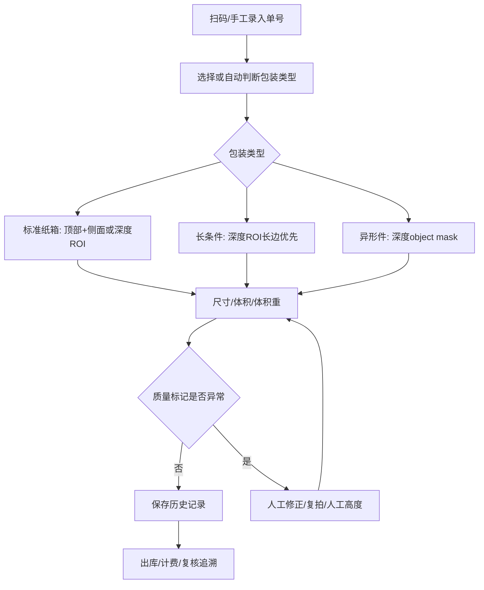

# 汽车备件测量落地方案

## 目标场景

PackVision 深度相机分支面向汽车备件仓库、海外仓、售后件发货和退件复核。核心目标不是只“测一个盒子”，而是把包装、单号、测量、异常复核和历史追溯连成一个工位流程。

## 包装类型

### 1. 标准纸箱

典型件：

- 滤芯
- 火花塞
- 小型传感器
- 刹车片
- 维修套件

推荐模式：

```text
top_plus_side_or_depth_roi
```

流程：

1. 扫描单号或 SKU。
2. 纸箱放到台面，尽量让长边水平。
3. 顶部/深度 ROI 测长宽。
4. 侧面照、人工高度或深度相机测高。
5. 自动保存历史记录。

### 2. 长条件

典型件：

- 减震器
- 雨刮
- 拉杆
- 排气管局部件
- 饰条

推荐模式：

```text
depth_roi_long_item
```

关键点：

- 长边超过 1200 mm 自动打 `oversize_length` 标记。
- 如果台面放不下，先测最大可见长度并进入人工复核。
- 双相机阶段可考虑前后两段拼接。

### 3. 软包 / 异形包装

典型件：

- 保险杠饰条
- 轮眉
- 格栅
- 管件
- 裹膜件
- 非规则泡棉保护件

推荐模式：

```text
depth_object_mask
```

逻辑：

1. 以桌面深度作为背景。
2. 找出比桌面更靠近相机的物体像素。
3. 把物体像素投影成点云。
4. 用点云最大范围计算长宽。
5. 用桌面深度减物体顶部深度计算高度。

这个模式比普通矩形框更适合异形件，因为它不会把 ROI 内空白区域都当成物体尺寸。

### 4. 易碎、反光、黑色、透明件

深度相机对材质有边界：

- 黑色吸红外，可能深度缺失。
- 反光件可能出现局部错误深度。
- 透明件可能穿透或丢深度。
- 软包边缘可能随摆放变形。

系统策略：

- 深度有效像素比例低时打 `sparse_depth_roi` 或 `small_object_mask`。
- 需要人工复核时打 `manual_review_recommended`。
- 保留手动框选和人工高度输入，不能让算法“假装准确”。

## 工位流程



## API 对应

### 行业包装画像

```text
POST /api/industry/profile
```

用于根据尺寸、备件类型、包装提示、材质提示和重量，返回：

- `package_class`
- `recommended_capture_mode`
- `material_class`
- `material_risk_level`
- `material_capture_adjustments`
- `handling_flags`
- `volumetric_weight_kg`
- `chargeable_weight_kg`

`material_hint` 可填：

- `reflective`：反光膜、金属件、镀铬饰条。
- `transparent`：灯罩、透明袋、玻璃/亚克力件。
- `dark_absorbing`：深黑橡胶、黑色吸光材质。
- `deformable`：泡棉、软袋、易压缩件。

当材质有风险时，流程会增加 `material_surface_check` 和 `retake_or_manual_verify`，并保留人工抽检建议。

### 标准深度 ROI

```text
POST /api/depth/measure-roi
```

适合纸箱、规则长方体和手动框选区域。

### 异形件深度 mask

```text
POST /api/depth/measure-object
```

适合异形件、软包、裹膜件、空白区域较多的 ROI。

### 到货试运行验收

```text
GET /api/validation/trial-plan
POST /api/validation/evaluate
GET /api/validation/trial-template.csv
POST /api/validation/evaluate-csv
```

`trial-plan` 给出每类包装和异常材质的最低抽检数量与容差；`evaluate` 用系统测量值和卷尺/卡尺真值计算误差，输出是否可以进入现场试运行。它不依赖真实相机，硬件到货前也可以用合成数据或历史记录演练流程。

现场落表推荐使用 `trial-template.csv`：仓库人员用 WPS/Excel 录入单号、系统长宽高、人工真值、实际重量和备注，再上传到 `evaluate-csv`。这样不用让一线人员手写 JSON，也能保留可追溯的样本清单。

### 到货调试准备

```text
GET /api/depth/workflow-guide
```

`workflow-guide` 把硬件到货准备变成可调用接口：管理员权限、官方 Viewer、USB 数据延长线、有源 USB 3.0 Hub、支架、卷尺/卡尺、哑光桌面和稳定光线都会列入清单。对于两台相机、长条件、反光件这类更难组合，接口会提示先走短数据线、不同 USB 口和有源 Hub，不默认要求购买主板。

## 到货验证方法

1. 安装驱动：

```text
D:\BaiduNetdiskDownload\奥比中光Astra Pro\上位机软件\Window 驱动\SensorDriver_V4.3.0.17.exe
```

2. 用上位机确认 RGB 和 Depth：

```text
D:\BaiduNetdiskDownload\奥比中光Astra Pro\上位机软件\上位机软件\OrbbecViewer.exe
```

3. 运行 PackVision 诊断：

```powershell
.\scripts\check_astra_depth_status.ps1
```

4. 采集样品：

- 标准纸箱 5 件
- 长条件 5 件
- 软包/异形件 10 件
- 黑色/反光/透明材质各 2 件

5. 每件记录人工真值和系统值，计算相对误差。

## 当前工程状态

已完成：

- Astra Pro 教程资料识别。
- OpenNI2 运行时检测。
- 深度 ROI 测量算法。
- 异形件 object mask 测量算法。
- 汽车备件包装画像和推荐采集模式。
- 异常材质风险画像，包括反光、透明、深黑吸光、易变形材质。
- 无硬件合成深度图测试。

待硬件到货：

- 接入真实 SDK 帧。
- UI 增加深度相机实时预览。
- 双相机设备选择和序列号绑定。
- 实测误差报告和阈值调优。
