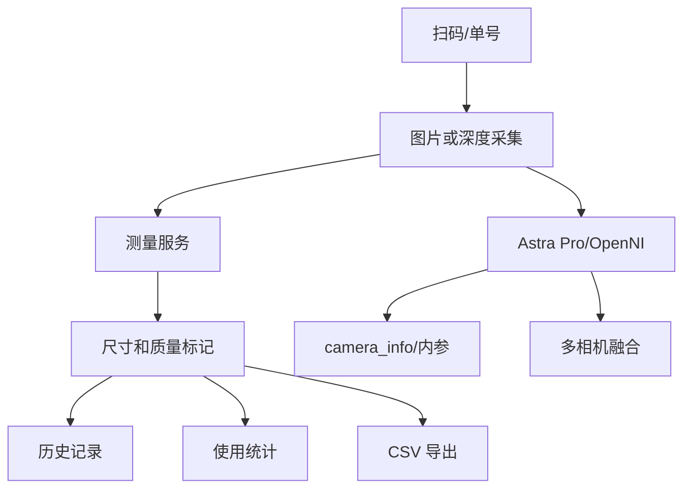

# PackVision 完整项目报告

> 日期：2026-05-28  
> 分支：`codex/astra-pro-depth-camera`  
> 项目目录：`D:\Documents\包装尺寸检测`

## 项目定位

PackVision 是面向汽车备件仓库的本地包装尺寸检测工作台。它要解决的不是单点算法演示，而是仓库现场完整流程：扫码或录入单号、上传图片或连接 Astra Pro 深度相机、自动测量尺寸、识别异常材质风险、保存历史记录、统计使用次数、导出 CSV、支持海外仓交付。

## 当前能力总览

| 能力 | 状态 | 说明 |
| --- | --- | --- |
| 手机/图片上传测量 | 已完成 | 顶部图、侧面图、ArUco、相机距离/焦距估算、手动框选。 |
| 单号/条码 | 已完成 | 手动单号、扫码枪文本、条码/二维码图片识别。 |
| 历史追溯 | 已完成 | SQLite 保存时间戳、单号、尺寸、置信度、图片和标注图。 |
| 后台统计 | 已完成 | 调用次数、测量次数、成功/失败次数、CSV 导出。 |
| 多语言主题 | 已完成基础版 | 中文、英文、乌克兰语，明亮/深色/石墨主题。 |
| Astra Pro 深度相机 | 已完成无硬件底座 | 驱动/上位机/OpenNI 状态检查、内参归一化、采集探测、深度测量。 |
| 异形件和长条件 | 已有算法基础 | object mask、深度 ROI、主轴测量、质量门控。 |
| 多相机扩展 | 已有架构 | 相机角色、序列号、三视图缺口、保守融合。 |
| 海外仓交付 | 已完成第一版 | 可生成 100 MB 内的现场交付包。 |
| 自动化开发 | 已配置 | `packvision` 自动化和 `scripts\dev_cycle.ps1`。 |

## 当前验证

测试结果：

```text
95 passed in 6.97s
```

最新交付包：

```text
D:\Documents\包装尺寸检测\release\PackVision_Field_Kit_20260528_0842.zip
```

大小：

```text
73.46 MB
```

## 开箱即用结论

| 场景 | 结论 |
| --- | --- |
| 图片版 | 可以开箱即用。 |
| 单号/扫码/历史/统计 | 可以开箱即用。 |
| Astra Pro 实时采集 | 需要目标电脑先安装驱动，并用 OrbbecViewer 验证画面。 |
| 多相机三视图 | 需要现场调试支架、USB、序列号和视角关系。 |

核心判断：

> PackVision 交付包可以复制即用；Astra Pro 深度相机不能完全免驱动，必须让海外仓提前完成驱动和官方上位机验证。

## 关键命令

运行项目：

```powershell
.\.venv\Scripts\python.exe -m packvision.main
```

打包 EXE：

```powershell
PowerShell -ExecutionPolicy Bypass -File .\scripts\build_exe.ps1
```

生成交付包：

```powershell
PowerShell -ExecutionPolicy Bypass -File .\scripts\build_handoff_package.ps1
```

开发循环：

```powershell
PowerShell -ExecutionPolicy Bypass -File .\scripts\dev_cycle.ps1
```

带打包验证：

```powershell
PowerShell -ExecutionPolicy Bypass -File .\scripts\dev_cycle.ps1 -BuildPackage
```

## 关键接口

| 接口 | 用途 |
| --- | --- |
| `GET /api/deployment/readiness` | 开箱即用和现场环境体检。 |
| `POST /api/measure` | 图片测量。 |
| `POST /api/orders/scan` | 扫码/手工单号标准化。 |
| `POST /api/orders/decode-image` | 条码/二维码图片识别。 |
| `GET /api/history` | 历史记录。 |
| `GET /api/usage/summary` | 使用次数统计。 |
| `GET /api/depth/status` | Astra Pro 状态。 |
| `POST /api/depth/capture/probe` | 相机采集探测。 |
| `POST /api/depth/measure-object` | 异形件深度测量。 |
| `POST /api/depth/fuse-measurements` | 多视角融合。 |
| `GET /api/validation/trial-template.csv` | 现场真值模板。 |
| `POST /api/validation/evaluate-csv` | 批量误差评估。 |

## 技术架构



## 海外仓准备

海外仓提前准备：

- Astra Pro 相机。
- Windows 10/11 64 位电脑。
- Astra Pro Windows 驱动。
- OrbbecViewer。
- 原装 USB 数据线；如需延长，优先主动 USB-A 公对母延长线。
- 厂商棋盘格标定板，优先从 `GET /api/depth/vendor-calibration-board.pdf` 打印；A4 ArUco 只作为手机照片兜底比例尺。
- 稳定支架、哑光工作台、稳定光照。
- 卷尺/卡尺和标准样品。

## 当前风险

| 风险 | 应对 |
| --- | --- |
| 真实 Astra Pro 尚未连接验证 | 相机到货后先跑 OrbbecViewer，再跑 readiness 和 capture probe。 |
| 单目照片无法稳定真实三维尺寸 | 图片版作为兜底，真实尺寸以深度相机为主线。 |
| 异形件/异常材质样本不足 | 后续建立复核样本池和真值模板。 |
| AI 模型可能导致包变重 | 后续插件化，不进入基础包。 |
| 多相机外参未验证 | 后续单独分支探索。 |

## 后续路线

1. 工业现场 UI 自动化：员工只扫码、放件、点测量；主按钮默认走 Astra Pro 深度采集，没有相机或主动上传照片时才走图片兜底。
2. 真值模板与复核样本池：把失败、低置信、人工修正样本变成训练资产。
3. Astra Pro 到货验证：标准纸箱、长条件、异形件、异常材质。
4. AI 插件接口：YOLO/分割/单目深度都作为可选插件。
5. 多相机三视图：top/front/side，序列号绑定，保守融合。

## 当前结论

PackVision 已经具备可交付雏形：图片版能跑，深度相机版有完整接入底座，海外仓交付包可生成并低于 100 MB，历史、统计、单号、文档和自动化已经形成闭环。真实相机到货后，下一步重点是插机验证和现场误差评估。
