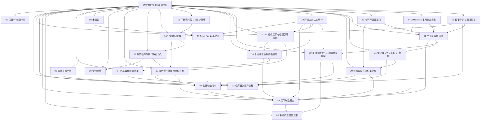

# PackVision 知识地图

> [!abstract] 一句话
> PackVision 是一个给汽车备件仓库用的包装尺寸检测系统：员工只负责扫码、放件、测量；系统负责相机连接、尺寸识别、异常提示、历史记录和统计汇报。

## 先看哪篇

- 第一次了解项目：[[01 PackVision 项目一句话说明]]
- 仓库员工怎么用：[[02 仓库日常操作流程]]
- 摄像头到了怎么验收：[[04 Astra Pro 到货验收清单]]
- 看不懂深度相机：[[03 Astra Pro 深度相机新手教程]]
- 项目接口和数据怎么连：[[05 PackVision 接口与数据流]]
- 后面上三台相机：[[06 多相机三视图方案]]
- 汽车备件怎么分场景测：[[07 汽车备件测量场景]]
- 出问题先查：[[08 现场排错手册]]
- 名词看不懂：[[09 PackVision 术语表]]
- 想继续学习：[[10 PackVision 学习路线]]
- 海外仓交付前准备：[[12 海外仓开箱即用交付方案]]
- 后续怎么持续开发：[[13 分阶段开发执行与自动化]]
- 看完整项目报告：[[14 PackVision 完整项目报告]]
- 厂商资料包怎么进 Git：[[15 厂商资料包 Git 维护策略]]
- 失败样本怎么沉淀：[[16 复核样本池与真值闭环]]
- AI 模型怎么轻量接入：[[17 AI 插件接口与轻量部署策略]]
- 三台相机怎么验收外参：[[18 多相机外参与三视图验收方案]]
- 开发方向有没有走偏：[[19 开发方向二次审计与高星项目差距]]
- 实时采集和体积重怎么算：[[20 实时监控与体积重计费]]
- UI 怎样才算专业 DWS 工位：[[21 专业级 DWS 工位 UI 标准]]
- 架构是否要重做：[[22 工业级架构评估与中型升级方案]]
- 电子秤和体积重怎么闭环：[[23 电子秤适配接口与体积重闭环]]
- WMS/TMS 怎么先不丢数据：[[24 WMS TMS 本地集成队列]]
- 相机断连/卡顿怎么恢复：[[25 设备守护与现场恢复]]

## 笔记网络

## 当前项目状态

- 本地项目目录：`D:\Documents\包装尺寸检测`
- Astra Pro 安装目录：`D:\app\orbbec-astra-pro`
- 相机配置文件：`D:\app\orbbec-astra-pro\packvision-depth-cameras.json`
- Obsidian 笔记目录：`D:\Documents\笔记\AI\PackVision`
- 当前服务地址：`http://127.0.0.1:8765`
- GitHub 分支：`codex/astra-pro-depth-camera`

## 现在已经做到什么

- 手机/图片上传测量。
- 单号手动录入、条码识别、历史记录。
- 后台调用次数、测量次数、CSV 导出。
- Astra Pro 驱动和上位机已安装到 `D:\app`。
- PackVision 已有 OpenNI 深度相机接口。
- 已预留多相机三视图结构。
- 新增开箱即用 readiness 体检接口和现场交付包脚本。
- 新增分阶段开发执行方案和 dev-cycle 自动化脚本。
- 新增复核样本池接口和 UI，低置信、异常材质、多视角冲突自动沉淀。
- 新增 AI 插件发现接口，基础包不内置重模型，模型能力作为可选安装项。
- 新增多相机外参验收接口，三视图冲突会进入复核而不是静默通过。
- 新增开发方向二次审计，明确自动测量、真实内参、点云证据、样本闭环和 UI 工作站化是下一轮最重要缺口。
- 新增实时采集监控与体积重计费：相机持续测量，按钮只负责记录；实重、体积重、计费重和规则进入历史追溯。
- 新增专业级 DWS 工位 UI 标准：首屏常驻工位状态、单号、计费重、质检结论和深度证据。
- 新增工业级架构中型升级方案：主流程改为多相机实时监控，按钮只记录稳定结果，照片上传降级为兜底。
- 新增电子秤适配接口：基础包手动兜底，预留 mock、USB HID、RS232 电子秤 adapter。
- 新增 WMS/TMS 本地集成队列：测量保存后自动写入本地 outbox，WMS/TMS 不在线也不影响继续测量。
- 新增设备 watchdog：统一判断相机枚举、实时流卡顿、模拟兜底和现场恢复动作。

## 还差什么

- Astra Pro 实物到货后插机验证。
- 用真实纸箱、长条件、异形件做误差测试。
- 把深度测量从中心 ROI 兜底升级为自动找物体、自动判断风险。
- 保存点云证据和真实相机元数据，支撑后续误差追溯。
- 如果误差大，再导入厂商/ROS 的 camera_info 或重新标定。
- 如果未来买更好的深度相机，只新增相机后端，不推翻项目结构。
- 目标海外仓电脑需要提前完成 Astra Pro 驱动和 OrbbecViewer 验证。
- 后续还要按不同国家仓库补真实 WMS/TMS URL、认证、字段映射和后台自动推送 worker。
- Astra Pro 到货后要验证设备 watchdog 的真实相机状态和恢复动作是否准确。

## 资料库

- [[Astra Pro 厂商资料学习笔记]]：完整厂商资料阅读笔记，偏工程细节。
- [[12 海外仓开箱即用交付方案]]：给国外仓库提前准备和现场交付用。
- [[13 分阶段开发执行与自动化]]：后续持续开发、自动化和分支策略。
- [[14 PackVision 完整项目报告]]：同步 GitHub README 的项目总报告。
- [[15 厂商资料包 Git 维护策略]]：后续维护 Astra Pro 和新相机厂商资料包。
- [[16 复核样本池与真值闭环]]：失败、低置信和异常材质样本如何进入复核和训练闭环。
- [[17 AI 插件接口与轻量部署策略]]：YOLO、分割、单目深度先验如何作为可选插件接入。
- [[18 多相机外参与三视图验收方案]]：两台/三台相机外参、序列号和视角冲突怎么验收。
- [[19 开发方向二次审计与高星项目差距]]：核对厂商资料和 GitHub 高星项目后，项目当前最需要补的差距。
- [[20 实时监控与体积重计费]]：现场实时采集监控、实重输入、体积重规则和计费重保存逻辑。
- [[21 专业级 DWS 工位 UI 标准]]：对标商业 DWS 软件后形成的 PackVision 工位 UI 判断标准。
- [[22 工业级架构评估与中型升级方案]]：为什么不推倒重来、如何补 Station Orchestrator 和多相机监控矩阵。
- [[23 电子秤适配接口与体积重闭环]]：实重、体积重、计费重和未来电子秤 adapter 怎么接。
- [[24 WMS TMS 本地集成队列]]：本地 outbox 如何保存、查看、导出以及未来对接 WMS/TMS。
- [[25 设备守护与现场恢复]]：相机未检测到、实时流卡住、模拟兜底时现场怎么恢复。
- 项目中文文档：`D:\Documents\包装尺寸检测\docs_cn`
- Astra Pro 本机安装说明：`D:\app\orbbec-astra-pro\安装说明.md`
