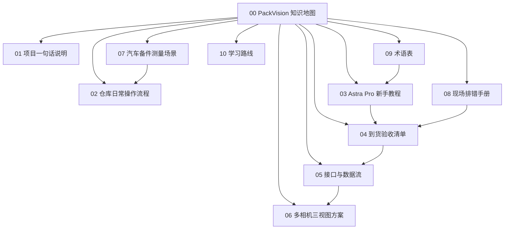

# PackVision 知识地图

> [!abstract] 一句话
> PackVision 是一个给汽车备件仓库用的包装尺寸检测系统：员工只负责扫码、放件、测量；系统负责相机连接、尺寸识别、异常提示、历史记录和统计汇报。

## 先看哪篇

- 第一次了解项目：[[01 PackVision 项目一句话说明]]
- 仓库员工怎么用：[[02 仓库日常操作流程]]
- 摄像头到了怎么验收：[[04 Astra Pro 到货验收清单]]
- 看不懂深度相机：[[03 Astra Pro 深度相机新手教程]]
- 项目接口和数据怎么连：[[05 PackVision 接口与数据流]]
- 后面上三台相机：[[06 多相机三视图方案]]
- 汽车备件怎么分场景测：[[07 汽车备件测量场景]]
- 出问题先查：[[08 现场排错手册]]
- 名词看不懂：[[09 PackVision 术语表]]
- 想继续学习：[[10 PackVision 学习路线]]

## 笔记网络

## 当前项目状态

- 本地项目目录：`D:\Documents\包装尺寸检测`
- Astra Pro 安装目录：`D:\app\orbbec-astra-pro`
- 相机配置文件：`D:\app\orbbec-astra-pro\packvision-depth-cameras.json`
- Obsidian 笔记目录：`D:\Documents\笔记\AI\PackVision`
- 当前服务地址：`http://127.0.0.1:8765`
- GitHub 分支：`codex/astra-pro-depth-camera`

## 现在已经做到什么

- 手机/图片上传测量。
- 单号手动录入、条码识别、历史记录。
- 后台调用次数、测量次数、CSV 导出。
- Astra Pro 驱动和上位机已安装到 `D:\app`。
- PackVision 已有 OpenNI 深度相机接口。
- 已预留多相机三视图结构。

## 还差什么

- Astra Pro 实物到货后插机验证。
- 用真实纸箱、长条件、异形件做误差测试。
- 如果误差大，再导入厂商/ROS 的 camera_info 或重新标定。
- 如果未来买更好的深度相机，只新增相机后端，不推翻项目结构。

## 资料库

- [[Astra Pro 厂商资料学习笔记]]：完整厂商资料阅读笔记，偏工程细节。
- 项目中文文档：`D:\Documents\包装尺寸检测\docs_cn`
- Astra Pro 本机安装说明：`D:\app\orbbec-astra-pro\安装说明.md`
