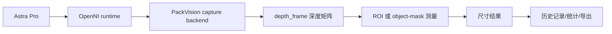

# PackVision 接口与数据流

[[00 PackVision 知识地图|返回知识地图]]

## 数据从哪里来

PackVision 有三类输入：

1. 手机或上传图片。
2. Astra Pro 深度相机。
3. 人工校正和单号信息。

## 深度相机主链路



## 相机接口

| 接口 | 用途 |
| --- | --- |
| `GET /api/deployment/readiness` | 海外仓开箱即用体检：EXE、数据目录、驱动、上位机、OpenNI、相机连接、准备清单 |
| `GET /api/depth/cameras` | 看配置了几台相机、是否连上、三视图还缺什么 |
| `GET /api/depth/status` | 看驱动、OpenNI、厂商资料状态 |
| `GET /api/depth/vendor-calibration-board.pdf` | 打开 Astra Pro 厂商棋盘格标定板 |
| `GET /api/depth/astra/tutorial-playbook` | 看厂商教程二次审计后的 ROS2 控制、多相机、标定和点云适配 |
| `POST /api/depth/capture/probe` | 探测相机能不能采集 |
| `POST /api/depth/capture/frame` | 采集一帧深度数据 |
| `POST /api/depth/measure-capture` | 工作台主流程：采集并直接测量；未传 ROI 时自动使用中心作业区 |
| `POST /api/depth/simulate-from-image` | 上传真实图片，用 Astra 模拟内参和合成深度帧做硬件到货前干跑 |

## 测量接口

| 接口 | 适合场景 |
| --- | --- |
| `POST /api/depth/measure-roi` | 标准纸箱、规则矩形区域 |
| `POST /api/depth/measure-object` | 异形件、软包、保险杠、空白区域多的 ROI |
| `POST /api/depth/fuse-measurements` | 多相机、多视角结果融合 |

## 单号与历史

系统保存：

- `order_id`：单号。
- `barcode_text`：条码内容。
- `measurement_id`：测量记录 ID。
- `created_at`：时间戳。
- `dimensions`：长宽高体积。
- `quality_flags`：质量标记。
- `recommendation_codes`：建议动作。

## 后台统计

后台会记录：

- 接口调用次数。
- 测量次数。
- 成功率。
- 最近调用。
- 单号关联。
- CSV 导出。

这部分用于以后汇报：今天测了多少次、失败多少次、异常集中在哪类。

## 相机配置文件

位置：

`D:\app\orbbec-astra-pro\packvision-depth-cameras.json`

核心字段：

```json
{
  "camera_id": "astra-pro-top-01",
  "role": "top",
  "backend": "openni2_primesense",
  "model": "Orbbec Astra Pro",
  "serial_hint": null,
  "ros2_profile": {
    "launch_file": "astra_pro.launch.xml",
    "device_num": 1,
    "operator_policy": {
      "measurement_mode": "auto",
      "manual_intrinsics_allowed": false
    }
  }
}
```

后面增加相机时，先增加配置，不要改仓库操作流程。

## 厂商教程适配接口

`GET /api/depth/astra/tutorial-playbook` 是给工程调试看的，不是给仓库员工操作的。它把厂商教程里的内容翻译成 PackVision 语言：

- 曝光、增益、白平衡、镜像、激光、流开关服务。
- `device_num`、serial number、`multi_astra.launch.xml`、`cleanup_shm_node`。
- `ir_info_url`、`color_info_url` 和 `camera_name` 规则。
- 点云、彩色点云、D2C 对齐何时启用。

原则：员工只负责扫码、放货、自动采集、确认保存；工程师才处理 ROS2 参数。

## 真实图片模拟深度

硬件没到货时，可以先用公开真实箱内场景图跑完整链路：

```powershell
.\scripts\run_real_sample_simulation.ps1
```

默认样例来自 CLUBS Dataset：

`https://clubs.github.io/gif/box_000.gif`

输出在：

`D:\Documents\包装尺寸检测\data\simulation_samples\clubs_box_000`

这不是最终精度证明，只是验证真实 RGB 图片、Astra 近似内参、合成深度帧、object-mask 测量、标注图和后台统计能连起来。

继续读：[[06 多相机三视图方案]]
