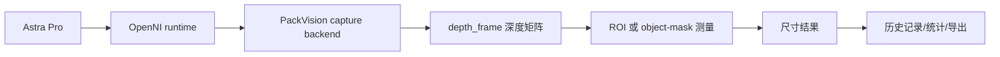

# PackVision 接口与数据流

[[00 PackVision 知识地图|返回知识地图]]

## 数据从哪里来

PackVision 有三类输入：

1. 手机或上传图片。
2. Astra Pro 深度相机。
3. 人工校正和单号信息。

## 深度相机主链路



## 相机接口

| 接口 | 用途 |
| --- | --- |
| `GET /api/depth/cameras` | 看配置了几台相机、是否连上、三视图还缺什么 |
| `GET /api/depth/status` | 看驱动、OpenNI、厂商资料状态 |
| `POST /api/depth/capture/probe` | 探测相机能不能采集 |
| `POST /api/depth/capture/frame` | 采集一帧深度数据 |
| `POST /api/depth/measure-capture` | 采集并直接测量 |

## 测量接口

| 接口 | 适合场景 |
| --- | --- |
| `POST /api/depth/measure-roi` | 标准纸箱、规则矩形区域 |
| `POST /api/depth/measure-object` | 异形件、软包、保险杠、空白区域多的 ROI |
| `POST /api/depth/fuse-measurements` | 多相机、多视角结果融合 |

## 单号与历史

系统保存：

- `order_id`：单号。
- `barcode_text`：条码内容。
- `measurement_id`：测量记录 ID。
- `created_at`：时间戳。
- `dimensions`：长宽高体积。
- `quality_flags`：质量标记。
- `recommendation_codes`：建议动作。

## 后台统计

后台会记录：

- 接口调用次数。
- 测量次数。
- 成功率。
- 最近调用。
- 单号关联。
- CSV 导出。

这部分用于以后汇报：今天测了多少次、失败多少次、异常集中在哪类。

## 相机配置文件

位置：

`D:\app\orbbec-astra-pro\packvision-depth-cameras.json`

核心字段：

```json
{
  "camera_id": "astra-pro-top-01",
  "role": "top",
  "backend": "openni2_primesense",
  "model": "Orbbec Astra Pro"
}
```

后面增加相机时，先增加配置，不要改仓库操作流程。

继续读：[[06 多相机三视图方案]]
