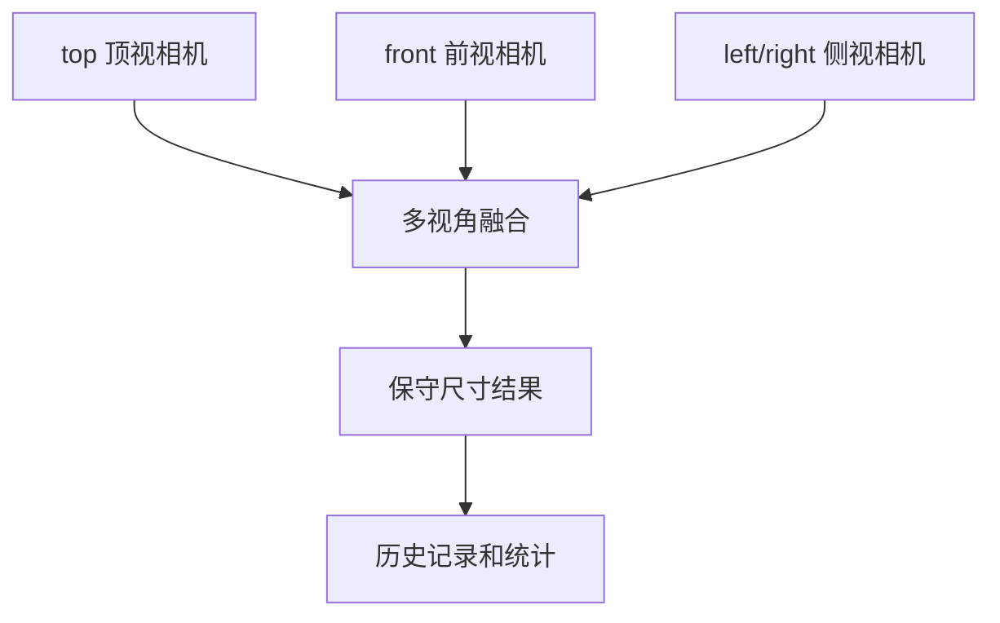

# 多相机三视图方案

[[00 PackVision 知识地图|返回知识地图]]

## 为什么要预留三台相机

一台顶视相机能测很多场景，但有盲区：

- 高度可能被遮挡。
- 长条件可能放不全。
- 保险杠、饰条、弯曲件从一个角度看不完整。

三视图就是让系统从多个角度看同一个物体。

## 推荐顺序

### 第一阶段：一台 top

先用 `top` 顶视图。

适合：

- 标准纸箱。
- 小件包装。
- 大部分能完整进入画面的异形件。

### 第二阶段：加 front

加 `front` 前视图。

作用：

- 校验高度。
- 看正面轮廓。
- 发现顶视图被遮挡的问题。

### 第三阶段：加 left 或 right

加 `left` 或 `right` 侧视图。

作用：

- 看长条件侧面轮廓。
- 补偿弯曲件。
- 提高大件异形件稳定性。

## 三视图结构



## 为什么用保守最大值

仓库和物流最怕“低估尺寸”。

所以多视角融合默认策略是：

> 长、宽、高取可信视角里的最大值。

这样更适合计费、装箱和异常复核。

## 配置怎么扩展

在 `D:\app\orbbec-astra-pro\packvision-depth-cameras.json` 里增加：

```json
{
  "camera_id": "astra-pro-front-01",
  "role": "front",
  "enabled": true,
  "backend": "openni2_primesense",
  "model": "Orbbec Astra Pro",
  "serial_hint": "第一次连多台相机后再填写"
}
```

多台相机时要尽量给每台写 `serial_hint`，避免拔插后顺序混乱。

## 后面换更贵的相机怎么办

不要推翻项目。

保留：

- `camera_id`
- `role`
- `depth_frame`
- `intrinsics`
- `quality_flags`
- `measurement result`

只新增后端，例如：

- `orbbec_sdk`
- `realsense`
- `azure_kinect`
- `stereo_depth`

这样仓库流程不变。

相关接口：[[05 PackVision 接口与数据流#相机接口]]
