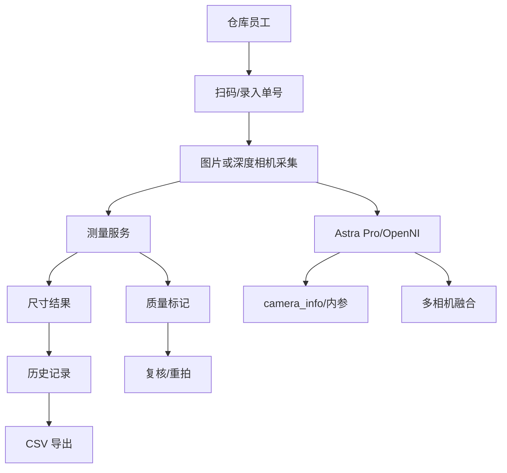

# PackVision 完整项目报告

> [!summary] 结论
> PackVision 已经从图片测量 Demo 推进为可交付的本地仓库测量工作台雏形：图片版可开箱即用，Astra Pro 深度相机版已有接入和验收底座，海外仓交付包可生成并控制在 100 MB 内。

## 项目定位

PackVision 服务汽车备件仓库的实际作业流程：

1. 扫码或录入单号。
2. 上传手机照片或连接 Astra Pro 深度相机。
3. 自动测量包装尺寸。
4. 标记异常材质和低置信风险。
5. 保存历史、标注图和测量结果。
6. 统计使用次数和测量次数。
7. 导出 CSV 给现场验收和管理汇报。

## 当前状态

| 模块 | 状态 |
| --- | --- |
| 图片上传测量 | 已完成 |
| 单号/条码 | 已完成 |
| 历史记录 | 已完成 |
| 后台统计 | 已完成 |
| Astra Pro 接入底座 | 已完成无硬件版 |
| 海外仓交付包 | 已完成第一版 |
| 多相机架构 | 已预留 |
| AI 插件 | 待设计 |
| 真实硬件验证 | 等相机到货 |

## 验证结果

```text
80 passed in 5.14s
```

最新交付包：

```text
D:\Documents\包装尺寸检测\release\PackVision_Field_Kit_20260528_0231.zip
```

大小：

```text
73.4 MB
```

## 开箱即用边界

- 图片版、扫码、历史、CSV、统计可以只靠 EXE。
- Astra Pro 需要目标电脑提前装驱动，并用 OrbbecViewer 验证画面。
- 多相机需要现场支架、USB、序列号和视角验证。
- 重 AI 模型不进入基础包，后续作为插件。

## 关键入口

GitHub README 已同步项目总报告：

```text
D:\Documents\包装尺寸检测\README.md
```

完整中文报告：

```text
D:\Documents\包装尺寸检测\docs_cn\23_PackVision_完整项目报告.md
```

开箱即用方案：

```text
D:\Documents\包装尺寸检测\docs_cn\21_海外仓开箱即用交付方案.md
```

开发自动化：

```text
D:\Documents\包装尺寸检测\docs_cn\22_PackVision_分阶段开发执行与自动化.md
```

## 技术架构



## 后续路线

1. 工业现场 UI 自动化。
2. 真值模板和复核样本池。
3. Astra Pro 到货插机验证。
4. AI 插件接口。
5. 多相机三视图与外参。

## 相关笔记

- [[00 PackVision 知识地图]]
- [[11 PackVision 对标路线图]]
- [[12 海外仓开箱即用交付方案]]
- [[13 分阶段开发执行与自动化]]
