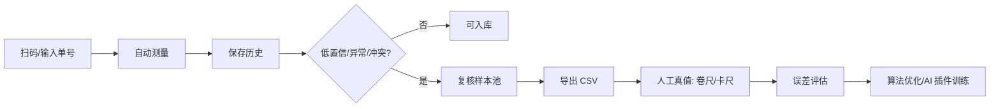

# 复核样本池与真值闭环

[[00 PackVision 知识地图]]

## 一句话

复核样本池把失败、低置信、异常材质、人工修正和多视角冲突的记录自动筛出来，变成现场真值验证和后续 AI 插件训练的数据入口。

## 新增接口

```text
GET /api/review/samples
GET /api/review/export.csv
GET /api/review/truth-template.csv
```

## 自动进入复核池的情况

- `status != measured`
- `confidence < 0.65`
- `depth_hole_risk`、`sparse_depth_frame`、`noisy_depth_roi`
- `reflective_depth_noise_risk`、`transparent_depth_dropout_risk`
- `manual_review_recommended`
- `view_disagreement_risk`
- `manual_top_box_used`、`manual_side_box_used`、`manual_height_used`

## 现场闭环



## UI 入口

PackVision 首页左侧导航：

```text
复核
```

复核页现在有两个导出：

- 复核 CSV：给主管看哪些样本需要处理。
- 真值模板 CSV：把系统测量值预填好，现场只填 `truth_length_mm`、`truth_width_mm`、`truth_height_mm`。

## 相关文档

- [[12 海外仓开箱即用交付方案]]
- [[14 PackVision 完整项目报告]]
- [[15 厂商资料包 Git 维护策略]]
