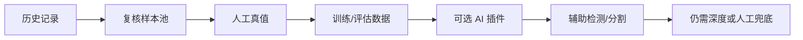

# AI 插件接口与轻量部署策略

[[00 PackVision 知识地图]]

## 一句话

PackVision 现在只做 AI 插件协议，不把 YOLO、SAM、Depth Anything 这类重模型塞进基础 EXE。

## 新增接口

```text
GET /api/ai/plugins
```

## 默认目录

```text
D:\Documents\包装尺寸检测\models
%LOCALAPPDATA%\PackVision\models
```

环境变量覆盖：

```powershell
$env:PACKVISION_AI_MODEL_ROOT="D:\PackVisionModels"
```

## 插件结构

```text
models/
  packvision-yolo/
    plugin.json
    weights/model.onnx
```

## 设计原则

- 基础包轻量。
- 模型权重不进基础包。
- 普通电脑优先 CPU 可跑。
- AI 是辅助，不替代深度相机实测。
- 模型失败必须回退到深度相机、OpenCV、人工框和复核样本池。

## 和复核样本池的关系



## 相关笔记

- [[16 复核样本池与真值闭环]]
- [[12 海外仓开箱即用交付方案]]
- [[14 PackVision 完整项目报告]]
