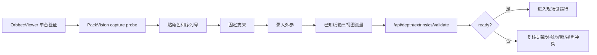

# 多相机外参与三视图验收方案

[[00 PackVision 知识地图]]

## 一句话

多相机外参验收用于工程人员固定 `top/front/side` 相机、绑定序列号、验证已知纸箱多视角是否一致；仓库员工不参与外参设置。

## 新增接口

```text
POST /api/depth/extrinsics/validate
```

## 验收检查

- 角色齐全：`top`、`front`、`side`
- 多相机序列号绑定
- 非参考相机有外参
- 用已知纸箱做多视角重叠验证
- 冲突时进入 `review`
- 融合继续使用 `conservative_max`

## 现场角色

| 角色 | 说明 |
| --- | --- |
| `top` | 俯拍参考相机 |
| `front` | 正面高度和轮廓交叉验证 |
| `side` / `left` / `right` | 侧向相机，任一侧都算 side |

## 状态

- `ready`：外参和重叠样本通过。
- `needs_attention`：可继续试运行，但三视图还不完整。
- `review`：多视角尺寸冲突。
- `blocked`：缺少关键外参、角色或序列号。

## 流程图



## 相关笔记

- [[06 多相机三视图方案]]
- [[12 海外仓开箱即用交付方案]]
- [[17 AI 插件接口与轻量部署策略]]
