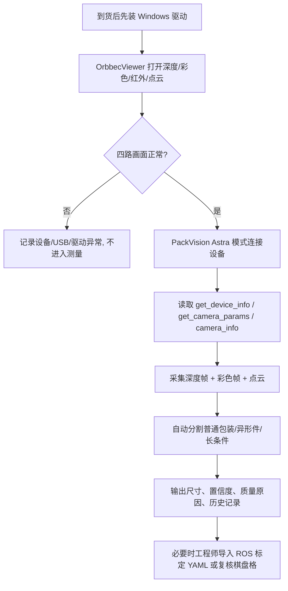

# PackVision - Astra Pro 厂商资料学习笔记

> [!tip] 新的阅读入口
> 这篇是厂商资料的完整工程笔记，细节比较多。第一次看建议先从 [[00 PackVision 知识地图]] 开始；如果只是想知道相机怎么用，看 [[03 Astra Pro 深度相机新手教程]]；如果相机到货要验收，看 [[04 Astra Pro 到货验收清单]]。

> [!important] 结论先行
> 我前面把“自研标定逻辑”放得太靠前了。Astra Pro 分支应该先使用厂商资料包里的驱动、OrbbecViewer、OpenNI/ROS SDK、`camera_info`、`get_camera_params` 和点云输出。我们自己的标定/校准逻辑只应作为兜底、复核和非 Astra 普通手机照片方案，不能替代厂商参数链路。

## 资料包总览

本轮已完成资料包全量索引，并重点阅读了与 PackVision 落地直接相关的说明、配置和接口。

| 类型 | 位置 | 作用 |
| --- | --- | --- |
| 产品规格书 | `D:\Documents\包装尺寸检测\奥比中光Astra Pro\产品规格书-Astra Pro_Datasheet _v2.0.pdf` | 硬件参数、距离范围、接口、精度、FOV、系统要求 |
| 上位机软件 | `D:\Documents\包装尺寸检测\奥比中光Astra Pro\上位机软件` | Windows 驱动、OrbbecViewer、OpenNI2 DLL 和配置 |
| ROS1 教程 | `D:\Documents\包装尺寸检测\奥比中光Astra Pro\ROS1系列教程` | 标定、点云、AR Tag、颜色识别和跟踪流程 |
| ROS2 教程 | `D:\Documents\包装尺寸检测\奥比中光Astra Pro\ROS2系列教程` | ROS2 启动、topic/service、相机参数、点云、D2C |
| Linux SDK | `D:\Documents\包装尺寸检测\奥比中光Astra Pro\Linux_SDK` | AstraSDK Linux 编译和示例 |
| 例程源码 | `D:\Documents\包装尺寸检测\奥比中光Astra Pro\相关例程源码` | ROS1 工作空间、OpenNI 示例、视觉跟踪和点云源码 |
| 标定板 | `D:\Documents\包装尺寸检测\奥比中光Astra Pro\棋盘格标定200x160_7x10.pdf` | 厂商随包棋盘格，工程师复核/重标定时使用 |

## 硬件规格

| 项 | Astra Pro 规格 |
| --- | --- |
| 成像原理 | 单目结构光 3D 成像 |
| 接口 | USB2.0，规格书也写明数据传输为 USB2.0 或以上 |
| 深度距离 | 0.6m - 8m |
| 深度输出 | 1280x1024@7FPS、640x480@30FPS、320x240@30FPS、160x120@30FPS |
| 彩色输出 | 1280x720@30FPS、640x480@30FPS、320x240@30FPS，UVC 输出 |
| 标称精度 | 1m: +/-3mm |
| 深度 FOV | H58.4°, V45.5° |
| 彩色 FOV | H66.1°, V40.2° |
| 功耗 | 2.5W MAX，峰值电流 500mA MAX |
| Windows 要求 | Windows 7/8/10，双核 2.2GHz 或以上，建议 4GB RAM 或以上 |
| 工作温度 | 10°C - 40°C |

对采购和现场部署的影响：

- 数据线核心要求是“能稳定传输数据的 USB 数据线”，不是只充电线。
- 相机本体规格写 USB2.0，但 ROS2 教程在虚拟机场景强调 USB3.0/USB3.1 兼容性，实际公司电脑建议优先插 USB3.x 口或稳定供电的扩展坞。
- 0.6m 以下不适合做主测量区，测量台高度、相机支架和视野要围绕 0.6m 以上工作距离设计。
- 2.5W/500mA 看起来不需要额外主板，但 USB 口、延长线和 hub 质量会直接影响掉线、帧率和启动成功率。

## Windows 上位机验收

厂商给的 Windows 验收路径很清楚：

1. 安装 `SensorDriver_V4.3.0.17.exe`。
2. 插入设备后，在设备管理器看到新的 `orbbec` 设备。
3. 解压并运行 `OrbbecViewer.exe`。
4. 依次打开深度、彩色、红外、点云。
5. 红外显示异常时，在红外分辨率下拉里选 `640*480@30 (RGB 888)`。
6. 四个图像都能正常显示，才算深度相机基础验收通过。

> [!note] 对 PackVision 的含义
> OrbbecViewer 不是我们最终仓库员工使用的软件，但它应该成为“到货验收”和“售后排查”的标准工具。PackVision 里要提供一个上位机验收清单入口，提示工程师先用厂商工具确认硬件正常，再进入自动测量。

### 本机已确认状态

2026-05-28 复核：

- Windows 已安装 `SensorDriver V4.3.0.17`。
- DriverStore 可见 `oem221.inf` / `obdrv4.inf`，Provider 为 `Orbbec`。
- 上位机已整理到 `D:\app\orbbec-astra-pro\viewer\OrbbecViewer.exe`。
- 启动脚本是 `D:\app\orbbec-astra-pro\启动上位机.bat`。
- 当前没有真实 Astra Pro 接入，所以只能确认驱动预装，不能确认深度画面。

更多解释见 [[26 Astra Pro 驱动与上位机说明]]。

## 标定资料

厂商随包标定教程走的是 ROS `camera_calibration` 流程：

```bash
# 彩色图标定
rosrun camera_calibration cameracalibrator.py image:=/camera/rgb/image_raw camera:=/camera/rgb --size 9x6 --square 0.02

# 深度/红外图标定
rosrun camera_calibration cameracalibrator.py image:=/camera/ir/image camera:=/camera/ir --size 9x6 --square 0.02
```

教程要点：

- 棋盘格要已知尺寸并展平。
- `size` 是内部角点数量，不是棋盘外框格子数量。
- 教程示例使用 `9x6` 内部角点和 `0.02m` 方格边长。
- 彩色标定后得到 `/tmp/calibrationdata.tar.gz`，解压后取 `ost.yaml`，按教程改名和改 `camera_name`。
- 深度/IR 标定类似，但可视化更不直观；教程建议同时看深度图和彩色图辅助。
- 结果放入 `~/.ros/camera_info`，ROS 相机驱动可读取。

需要注意：

- 资料包里的 `棋盘格标定200x160_7x10.pdf` 应作为工程师复核用标定板，不应要求仓库员工日常使用。
- 对 Astra Pro，默认优先使用厂商/设备内置参数和 ROS/OpenNI 输出的 `camera_info`；只有工程师在发现偏差、换设备或维修后才进入棋盘格重标定。
- 对手机照片方案，仓库员工不能手填焦距、内参，所以只能走自动 EXIF 读取、参考物、历史设备库和置信度提示，不能把人工参数输入作为主流程。

## ROS2/OpenNI 接口

ROS2 SDK 是 PackVision 深度相机分支最有价值的资料。

### 启动和查看

```bash
ros2 launch astra_camera astra_pro.launch.xml
ros2 topic list
ros2 run rqt_image_view rqt_image_view
rviz2
```

关键 topic/service：

```bash
ros2 topic echo /camera/depth/camera_info
ros2 topic echo /camera/color/camera_info
ros2 service call /camera/get_camera_info astra_camera_msgs/srv/GetCameraInfo '{}'
ros2 service call /camera/get_camera_params astra_camera_msgs/srv/GetCameraParams '{}'
ros2 service call /camera/get_device_info astra_camera_msgs/srv/GetDeviceInfo '{}'
ros2 service call /camera/get_sdk_version astra_camera_msgs/srv/GetString '{}'
```

`GetCameraParams` 返回：

- `l_intr_p`
- `r_intr_p`
- `r2l_r`
- `r2l_t`
- `l_k`
- `r_k`

ROS2 源码中 `ob_camera_info.cpp` 会通过 `device_->getProperty(openni::OBEXTENSION_ID_CAM_PARAMS, ...)` 读取设备相机参数，再组装成 ROS `CameraInfo`。这比我们自己在应用层猜内参可靠得多。

### 标定文件导入

ROS2 README 明确支持在 launch 中配置：

```xml
<arg name="ir_info_url" default="file:///you_ir_camera_calib_path/depth_camera.yaml"/>
<arg name="color_info_url" default="file:///you_depth_camera_calib_path/rgb_camera.yaml"/>
```

并强调：

- 彩色相机 `camera_name` 固定为 `rgb_camera`。
- 深度/IR 相机 `camera_name` 固定为 `ir_camera`。

PackVision 应新增“导入厂商/ROS 标定 YAML”的接口，而不是只保留自研标定入口。

### 点云和深度换算

OpenNI 与 ROS2 源码提供了可靠路径：

- 深度图编码是 `16UC1`，深度值单位按源码 `DepthTraits<uint16_t>::toMeters(depth) = depth * 0.001`，即毫米转米。
- 点云生成使用 `CameraInfo` 的 `fx/fy/cx/cy`：
  - `x = (u - cx) * depth / fx`
  - `y = (v - cy) * depth / fy`
  - `z = depth`
- OpenNI 还提供 `CoordinateConverter`：
  - `convertDepthToWorld`
  - `convertWorldToDepth`
  - `convertDepthToColor`
  - `convertC2DCoordinateByIntrinsic`
  - `convertD2CCoordinateByIntrinsic`

> [!tip] 项目决策
> PackVision 的 Astra 分支应把“深度帧 + CameraInfo + 点云/坐标转换”当主测量数据源。只要深度相机可用，就不要退回单目照片估算尺寸。

## 光照和材质风险

资料明确指出红外深度相机的弱点：

- 黑色物体吸收红外线，可能测距失败或噪声变大。
- 镜面反射物体只有在特定角度才会返回红外，且可能过曝。
- 透明物体红外可穿透，测距不可靠。
- 太近的物体不适合精确测距。

对仓库汽车备件的影响：

- 黑色橡胶件、亮面金属件、透明塑料袋、油污反光包装要进入“异常材质质量门控”。
- 现场不一定要追求极强可见光，但要避免强阳光直射红外结构光区域。
- 应固定测量台、背景和相机支架，减少每次摆放差异。
- 系统要自动给出置信度，不要让仓库员工理解光学原理。

## PackVision 开发修正



必须改掉的旧思路：

- 不能把应用层自研标定作为 Astra Pro 主入口。
- 不能让仓库员工手工输入内参、焦距、光圈。
- 不能让仓库员工选择“普通包装/异形件/长条件”模式，系统应自动分类并自动测量。
- 不能只做顶部照片；深度相机模式要以 3D 点云/主轴/包围盒测量为主，侧面信息自然进入三维数据。

应该新增或强化的功能：

- Astra 设备验收清单：驱动、设备管理器、OrbbecViewer 四路画面。
- 厂商参数读取：`get_camera_params`、`camera_info`、`get_device_info`、SDK 版本。
- 标定 YAML 导入：支持 `rgb_camera` 和 `ir_camera` 命名规范。
- 深度质量门控：距离范围、空洞率、黑/透明/反光风险、点云密度。
- 自动测量策略：普通箱体、异形件、长条件、异常材质自动分流。
- 审计日志：记录测量次数、设备序列号、SDK 版本、相机参数来源、置信度和异常原因。

## 给现场的简单口径

- 仓库员工只需要扫码/放件/点击或自动触发测量。
- 工程师到货时先用 OrbbecViewer 验收硬件。
- 工程师发现尺寸偏差时，再用 ROS 标定流程或导入 YAML。
- 软件后台自动记录测量次数、设备、单号、图像质量和结果，方便汇报。

## 下一步开发任务

- 在 PackVision 增加 `AstraVendorProfile`：保存设备型号、序列号、SDK 版本、相机参数来源。
- 增加 `CameraInfo`/`GetCameraParams` 导入和解析 API。
- UI 增加“设备验收/工程调试”入口，但仓库主界面保持自动测量。
- 测量算法优先使用点云主轴/包围盒，而不是单目像素比例。
- 将棋盘格标定保留为工程师工具，并明确标注“不用于仓库日常操作”。

## 二次审计补充

这次又把 ROS2 README 和 `astra_pro.launch.xml`、`multi_astra.launch.xml` 对了一遍，补上了之前没有完全进入项目的几块：

### ROS2 控制服务

需要记录进工程调试目录：

- 曝光：`set_ir_exposure`、`set_color_exposure`、自动曝光开关。
- 增益：`set_ir_gain`、`get_ir_gain`。
- 白平衡：`set_color_auto_white_balance`。
- 镜像：`set_depth_mirror`、`set_color_mirror`。
- 发射器与流：`set_laser_enable`、`toggle_depth`、`toggle_color`。

这些全部映射到：

```text
GET /api/depth/astra/tutorial-playbook
```

仓库员工不看这些参数；工程师用于解释光照、反光、黑色材质、画面翻转、流掉线等问题。

### 多相机关键点

厂商多相机教程里最重要的是：

- 用 `list_devices_node` 查设备。
- 用 serial number 固定相机角色。
- `device_num` 必须等于启用相机数量。
- 多相机启动失败后先跑 `cleanup_shm_node`。

PackVision 现在在 `GET /api/depth/cameras` 里返回这些命令，并在每台相机配置里生成 `ros2_profile`。

### 标定 URL

`ir_info_url`、`color_info_url` 和 `camera_name` 规则已经接入项目策略：

- 深度/IR 用 `ir_camera`。
- 彩色/RGB 用 `rgb_camera`。
- 通过 `/api/depth/camera-info/normalize` 转成测量内参。

结论还是一样：仓库员工不输入内参；设备或 YAML 给内参。
